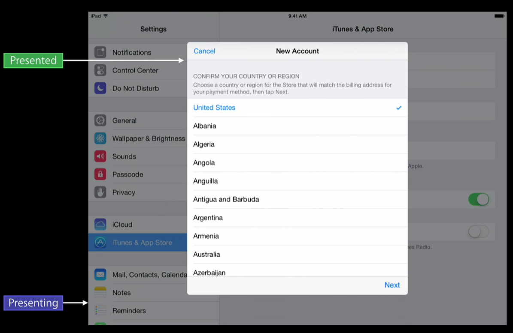
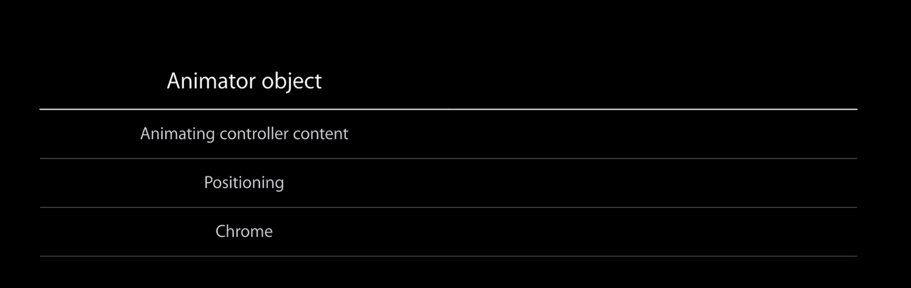
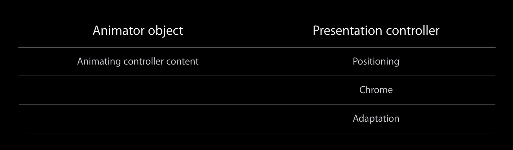
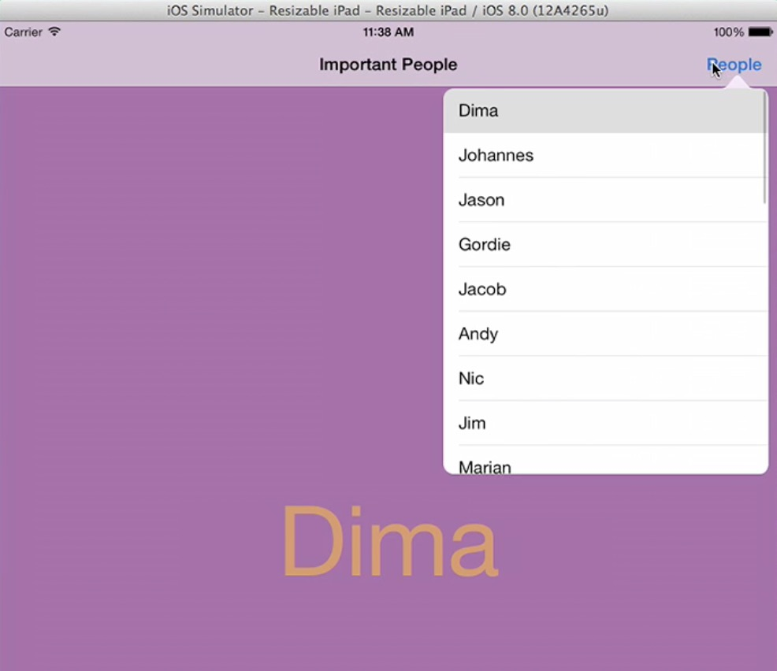
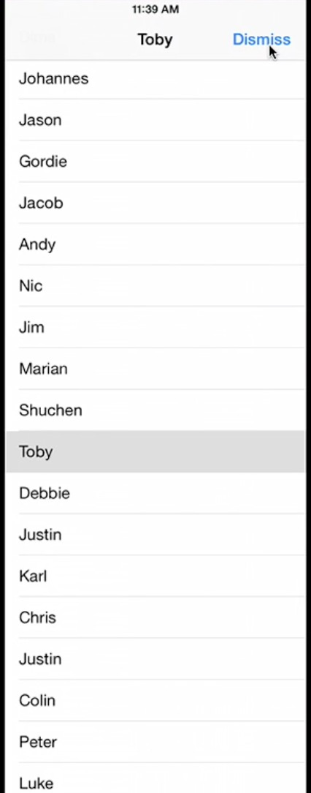
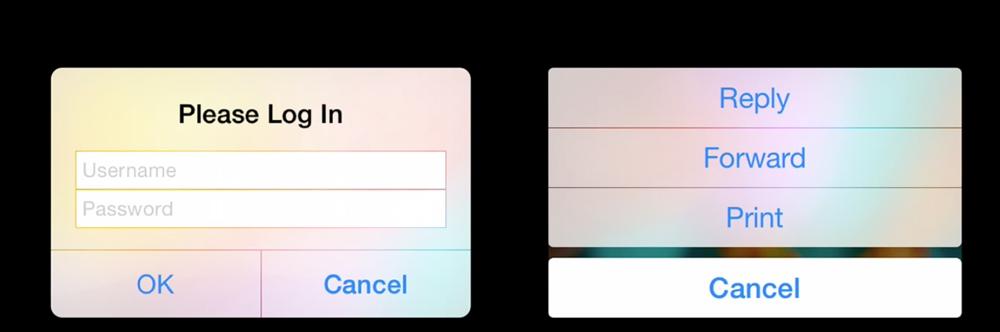
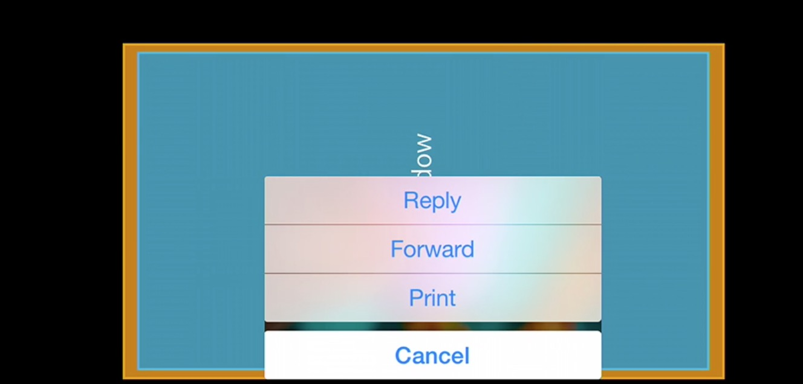
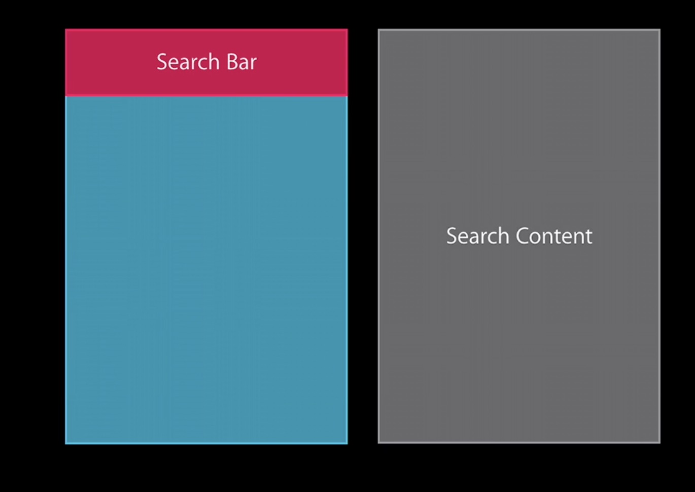
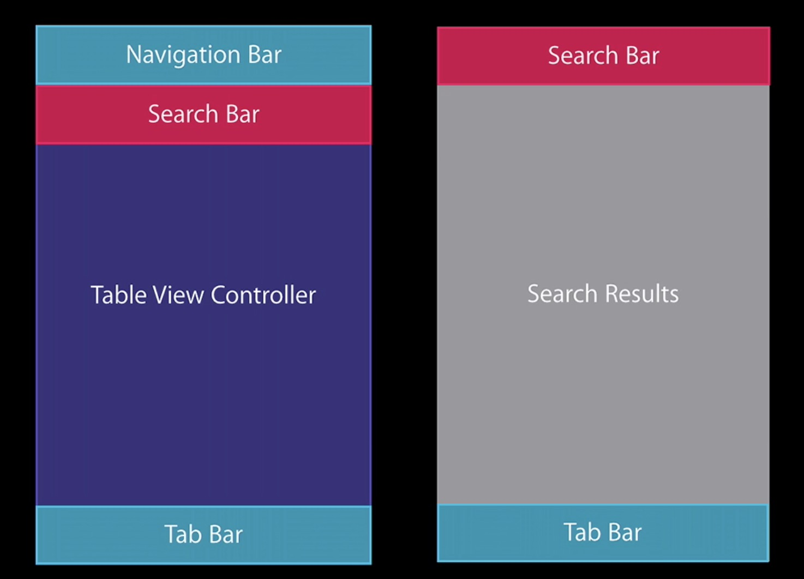

# A Look Inside Presentation Controllers 
教程地址：<https://developer.apple.com/videos/wwdc/2014/>  
代码地址：<https://developer.apple.com/library/ios/samplecode/LookInside/Introduction/Intro.html>
  
UIViewController 展示自 iOS 2  就开始有了，但是最近才能完全定制。 iOS 7 里 Apple 介绍了animator 对象的概念，它负责 view controller 在屏幕上做动画。但你如果想构建一个完全自己定制的 view controller 展示，依然很难。所以 iOS 8,Apple 有了 `UIPresentationController`。这个类使用 animator 对象来展示、管理、执行 view conroller 内容。  
  

##概念 

在展示一个 view controller 的时候，页面分为两个部分：  
  
1.  presenting view controller
2.  presented view controller  
  
  
  
上图来自 iPad 的 Setting 页面。 New Account 这个表格页面是 presented view controller，是整个页面的 content,是用户交互的地方；  

背景中带有黑色透明效果的 Setting 页面是 presenting view controller， 是被展示页面的 chrome（这个 chrome 不是 google 浏览器）。  

presenting view controller 能将 presented view controller 展示出来。  
  
 

 
  
iOS 8中，使用 `UIPresentationController` 来管理需要展示的 controller 的内容和 chrome. 它是展示管理类,支持所有的 UI view controller 的展示。因为 `UIPresentationController` 能提供 chrome，也能给 chrome 提供动画，甚至能和自定义动画同时进行。  
  
`UIPresentationController` 也会响应 Trait 和 Size 变化，即使 view controller 已经展示在手机屏幕上。  
  
最后一点，`UIPresentationController` 是可重用的，它和 animator 对象及过度动画代理（transitioning delegates）松耦合。不同的 view controller 间可以使用同一个 `UIPresentationController`，或者同一个 view controller 可以根据需要使用多个不同的 `UIPresentationController`。  
  
之前有提到过，在iOS 8 之前，animator 对象负担了大量的展示 view controller 任务。实际上，它的主要职责就是负责 controller 内容（包括子 view）的动画，以及它的偏移和坐标等。animator 还要知道屏幕上的坐标，如果你想自定义展示动画，就必须知道起始点和终点。So，animator 对象知道了太多它不该知道的东西。Animator 对象还要知道整体布局，各种 view 的包含关系。    
  
   

iOS8 开始，`UIPresentationController` 负责 view controller 的坐标位置，负责处理 chrome 和其他展示中需要的视图。    
  
##UIKit Presentations    
  
在 iOS8 中 UIKit 使用 `UIPresentationController` 优化了 Popovers, alerts, action sheets 和 search 。  
  
###Popovers  
  
在 iOS8 之前，使用以下代码展示 Popover

  ```  
    UIViewController* contentController = [[UIViewController alloc]init];
    UIPopoverController *poc = [[UIPopoverController alloc]initWithContentViewController:contentController];
    [poc presentPopoverFromBarButtonItem:item permittedArrowDirections:UIPopoverArrowDirectionAny animated:YES];  
  ```  
 
如果同时考虑 iPad 和 iPhone，代码需要改为  

    UIViewController* contentController = [[UIViewController alloc]init];
    if (([[UIDevice currentDevice] userInterfaceIdiom] == UIUserInterfaceIdiomPad)) {
        UIPopoverController *poc = [[UIPopoverController alloc]initWithContentViewController:contentController];
        [poc presentPopoverFromBarButtonItem:item permittedArrowDirections:UIPopoverArrowDirectionAny animated:YES];
    }else{
        [self presentViewController:contentController animated:YES completion:^{
            
        }];
    }


在 iOS8 中，使用 `UIPopoverPresentationController` 来管理 Popovers 的展示，只需一个代码就可以无缝在 iPhone 和 iPad 上运行，也能适应 regular 和 compact-width 环境  

    UIViewController* contentController = [[UIViewController alloc]init];
    contentController.modalPresentationStyle = UIModalPresentationPopover;
    
    UIPopoverPresentationController *popPC = contentController.popoverPresentationController;
    popPC.barButtonItem = item;
    popPC.permittedArrowDirections = UIPopoverArrowDirectionAny;
    [self presentViewController:contentController animated:YES completion:^{
        
    }];

iPad 运行效果如下：






修改模拟器尺寸，宽度改为 320（iPhone 尺寸），Popover 将会全屏显示，效果如下






`UIPopoverPresentationController` 有两个 delegate，通过它们可以改变 popover。  


第一个方法，返回三个选项之一： FullScreen, OverFullScreen, 或 none 。
```
- (UIModalPresentationStyle)adaptivePresentationStyleForPresentationController:(UIPresentationController *)controller;
```



第二个方法如果不实现，table controller 将会全屏展示，这样的话在我们的例子中，就看不到选中的文字在后面的 view 中显示。

```
- (UIViewController *)presentationController:(UIPresentationController *)controller viewControllerForAdaptivePresentationStyle:(UIModalPresentationStyle)style;
```
  
###Alert
  


在 iOS8 前，我们通过  UIAlertView 和 UIActionSheet 实现警告和选择页面。因为它们都是 UIView 的子类，因此必须重新实现一些 viewcontroller 上已经有的逻辑。比如，想要在应用里显示，就需要创建新的 UIWindow，这样才能显示在所有内容上面。

同时因为它们使用的老技术，必须使用 delegate 才能响应按钮点击。  
  
下面看一个 iOS 7 例子。Landscape 模式中显示 ActionSheet，下图中黄色部分是当前页面，蓝色部分是系统为 ActionSheet 创建的 window，白色部分是 content 的按钮。




在 iOS8 中，使用 UIAlertController （它是 UIViewController 的子类）来实现 alert 和 actionsheet，通过参数 preferred style 来切换，同时它是引入了 block 操作。

同时因为它继承自 UIViewController，因此能在你自己的 window 中显示，不需要系统来提供额外的支持。看一段代码：


    UIAlertController* sheet = [UIAlertController alertControllerWithTitle:@"警告" message:@"快到碗里来"preferredStyle:UIAlertControllerStyleActionSheet];
    [sheet addAction:[UIAlertAction actionWithTitle:@"好的" style:UIAlertActionStyleDefault handler:^(UIAlertAction *action) {
        
    }]];
    [self presentViewController:sheet animated:YES completion:^{
        
    }];

###Search

在 iOS8 前 serach 由两个部分组成：UI search bar 和 UISearchDisplayController。这种模式有以下缺点：

####限制性大

如果你在 table view 中显示搜索结果，这种模式非常合适。但是从 iOS 3 开始，我们可以在 collection view 和 map view 中显示结果，SearchDisplayController 就没法处理了。

而且 SearchDisplayController 并不是 UIViewcontroller。

####无法满足显示多样化
随着 iOS SDK 的成熟， view controller 越来越智能和强壮，SearchDisplayController 更无法满足你的显示需求。通常它都是在猜测你的意图，失败率挺高的。


####通过 addsubview 显示
因为 SearchDisplayController 并不是 view controller，它是通过 addsubview 来实现显示。让我们来看个例子：



上图中，红色部分是 searchbar, 蓝色部分是 content。点击红色的 searchbar 部分，SearchDisplayController 将会创建一个 content view（灰色部分），在上面添加 table view ，然后将它 addsubview 到 SearchDisplayController 的容器里，或 content view，或 content 所在的 viewcontroller 的 view 里。

整个流程下来，将会创建一个视图树。其实，我们只希望 SearchDisplayController 负责显示就行，其他应该和他无关。 

因此，在 iOS8 中，我们使用 UISearchController 来替换 UISearchDisplayController。它继承自 UIViewController。它又以下几个优势：
> 1.能在任何 ViewController 树中显示；
> 2.松耦合。SearchController 展示时，不用从结果和过滤后的结果间获取数据；你可以使用过滤后的结果直接驱动显示。
> 3.Searchbar 动画。你可以通过自定义动画对象来改变 search bar 动画。
> 4.自适应。SearchController 是基于 Presentation Controller 

```
    UISearchBar *searchBar = [[UISearchBar alloc]initWithFrame:CGRectZero];
    UISearchDisplayController *searchController = [[UISearchDisplayController alloc] initWithSearchBar:searchBar contentsController:self];
    searchController.searchResultsDataSource = self;
    searchController.searchResultsDelegate = self;
    self.tableView.tableHeaderView = searchController.searchBar;
```
大体流程是：先创建 searchbar，创建 searchController，指定搜索结果数据源，指定搜索 delegate，将searchbar赋给 tableview 的 headerview.

再来看看 iOS8 是如何工作的。

```
    MyResultsController *resultsController = [[MyResultsController alloc]init];

    UISearchController *searchController = [[UISearchController alloc]initWithSearchResultsController:resultsController];
    searchController.searchResultsUpdater = resultsController;
    self.tableView.tableHeaderView = searchController.searchBar;
    self.definesPresentationContext = YES;
```

首先创建搜索结果 viewController, 它可以是tableView，collectview，或任何自定义的 view。之后将它赋值给 UISearchController，然后告诉 UISearchController 谁负责更新结果。之后将 searchbar 赋给 table 的 headerview，这样当你点击 SearchController search bar 后，系统将会执行。definesPresentationContext 表示 UISearchController 在 present 时，是否可以覆盖当前controller。

来个图：



参照之前代码，应用的 root viewcontroller 是 tab controller，之上是 navigation controller，再上一层是 绿色的 table view controller，红色的 search bar 是 table header。点击红色 search bar 后， navigation bar 消失，search bar 将会占据这个位置（见右侧的图），同时搜索结果 view 将会占据 table view。因此代码中，`self.definesPresentationContext = YES；`,如果忽略这个参数，  View Controller Presentation 将会遍历整个链条看看谁愿意接收，一直问到 root view controller 为止。

汇总一下 UIPresentationController 的优势：
> 1.它是 viewcontroller。不需要再用 addsubview，或者创建一个新的 window。

> 2.content 和 chrome 抽象的非常好。UIPresentationController 给他们提供了 container，不再需要系统提供额外的支持。

> 3.适配性。它能让 alert， search 适配各种 size。


汇总以上的知识点，大家可以下载 sample 看看。sample 地址见文章顶部。

例子中涉及两个知识点：

UITraitCollection 这个类封装了像水平和竖直方向的Size Class等信息。

UIContentContainer,自 iOS 8  UIViewController 开始支持这个协议。我们自定义 ViewController 的时候可以重写这些方法来调整视图布局，比如我们可以在这些方法里调整 ChildViewControler 的位置。

```
- (void)systemLayoutFittingSizeDidChangeForChildContentContainer:(id <UIContentContainer>)container NS_AVAILABLE_IOS(8_0);

- (CGSize)sizeForChildContentContainer:(id <UIContentContainer>)container withParentContainerSize:(CGSize)parentSize NS_AVAILABLE_IOS(8_0);

- (void)viewWillTransitionToSize:(CGSize)size withTransitionCoordinator:(id <UIViewControllerTransitionCoordinator>)coordinator NS_AVAILABLE_IOS(8_0);

- (void)willTransitionToTraitCollection:(UITraitCollection *)newCollection withTransitionCoordinator:(id <UIViewControllerTransitionCoordinator>)coordinator NS_AVAILABLE_IOS(8_0);
```


##总结
### UIAlertControler 和 UISearchController 的API
iOS 8  为 alert，popOver, search 新增了 API，不需要再用 addsubview 添加到你的 view 树上。

### Presentations 可控
不需要系统提供额外的 viewcontroller，你可以自己定制整个展示流程和效果。


  





